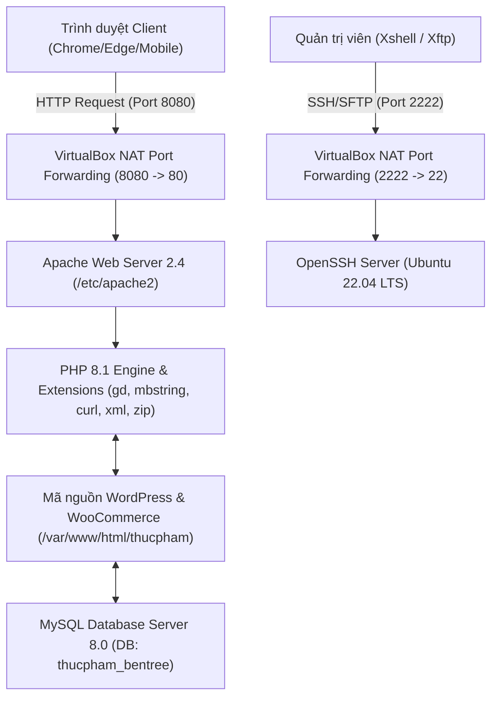
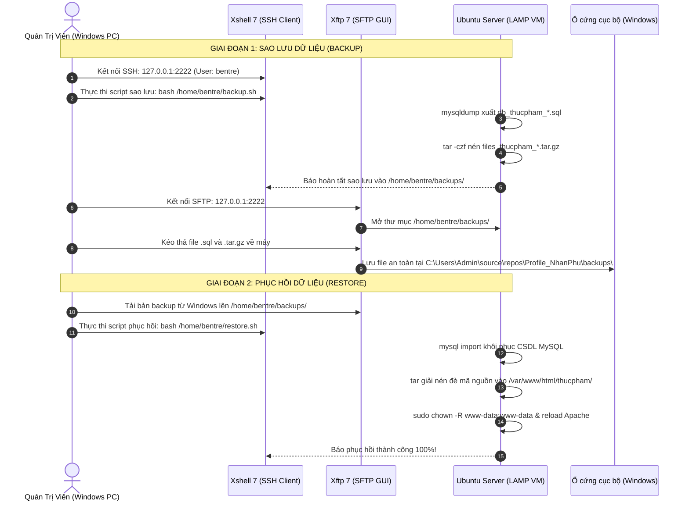

# BÁO CÁO ĐỒ ÁN MÔN HỌC: PHẦN MỀM MÃ NGUỒN MỞ

**ĐỀ TÀI:**  
**XÂY DỰNG WEBSITE THƯƠNG MẠI ĐIỆN TỬ BÁN THỰC PHẨM CHẾ BIẾN ĐẶC SẢN BẾN TRE TRÊN MÁY CHỦ MÃ NGUỒN MỞ LAMP VÀ CMS WORDPRESS**  
*(Định dạng giao diện: Chuỗi Siêu thị Bách Hoá Xanh - bachhoaxanh.com)*

---

* **Học phần:** Phần mềm mã nguồn mở (Open Source Software)
* **Sinh viên thực hiện:** Nguyễn Nhân Phú
* **Giảng viên hướng dẫn:** Bộ môn Công nghệ Phần mềm / Mạng máy tính
* **Hệ điều hành máy chủ:** Ubuntu Server 22.04.5 LTS (64-bit)
* **Nền tảng ứng dụng:** Apache 2.4 + MySQL 8.0 + PHP 8.1 + WordPress 6.x + WooCommerce 11.x
* **Công cụ quản trị từ xa:** VirtualBox, Xshell 7, Xftp 7, WP-CLI

---

## MỤC LỤC CHI TIẾT

1. [CHƯƠNG 1: TỔNG QUAN ĐỀ TÀI & PHÂN TÍCH YÊU CẦU](#chương-1-tổng-quan-đề-tài--phân-tích-yêu-cầu)
2. [CHƯƠNG 2: NGHIÊN CỨU & CÀI ĐẶT MÁY CHỦ ẢO MÔ HÌNH LAMP](#chương-2-nghiên-cứu--cài-đặt-máy-chủ-ảo-mô-hình-lamp)
3. [CHƯƠNG 3: NGHIÊN CỨU HỆ QUẢN TRỊ NỘI DUNG CMS WORDPRESS & WOOCOMMERCE](#chương-3-nghiên-cứu-hệ-quản-trị-nội-dung-cms-wordpress--woocommerce)
4. [CHƯƠNG 4: THU THẬP SỐ LIỆU 15 SẢN PHẨM THỰC PHẨM CHẾ BIẾN ĐẶC SẢN BẾN TRE](#chương-4-thu-thập-số-liệu-15-sản-phẩm-thực-phẩm-chế-biến-đặc-sản-bến-tre)
5. [CHƯƠNG 5: THIẾT KẾ XÂY DỰNG GIAO DIỆN THEO PHONG CÁCH BÁCH HOÁ XANH](#chương-5-thiết-kế-xây-dựng-giao-diện-theo-phong-cách-bách-hoá-xanh)
6. [CHƯƠNG 6: QUY TRÌNH SAO LƯU & PHỤC HỒI DỮ LIỆU QUA XSHELL VÀ XFTP](#chương-6-quy-trình-sao-lưu--phục-hồi-dữ-liệu-qua-xshell-và-xftp)
7. [CHƯƠNG 7: KẾT LUẬN & HƯỚNG PHÁT TRIỂN ĐỀ TÀI](#chương-7-kết-luận--hướng-phát-triển-đề-tài)

---

## CHƯƠNG 1: TỔNG QUAN ĐỀ TÀI & PHÂN TÍCH YÊU CẦU

### 1.1. Bối cảnh và Tính cấp thiết của đề tài
Trong thời đại chuyển đổi số và phát triển kinh tế nông nghiệp bền vững, các sản phẩm chế biến từ làng nghề truyền thống đóng vai trò quan trọng trong việc nâng cao giá trị chuỗi nông sản địa phương. Tỉnh Bến Tre - nổi tiếng với danh xưng "Xứ sở dừa Việt Nam" - sở hữu nhiều làng nghề truyền thống trứ danh như làng kẹo dừa Mỏ Cày, làng bánh phồng Sơn Đốc (Giồng Trôm), các cơ sở chế biến tôm khô Bình Đại, chả lụa và nem chua đậm đà hương vị Nam Bộ.

Tuy nhiên, việc phân phối phần lớn vẫn phụ thuộc vào thương lái và các chợ truyền thống. Xây dựng một **Website thương mại điện tử chuyên nghiệp, uy tín dựa trên mô hình chuỗi bán lẻ hiện đại (tương tự như Bách Hoá Xanh)** là giải pháp tối ưu giúp đưa đặc sản quê hương đến tay người tiêu dùng cả nước.

### 1.2. Mục tiêu nghiên cứu & Sản phẩm bàn giao
1. Làm chủ việc thiết lập máy chủ ảo Linux (Ubuntu Server) và mô hình dịch vụ mạng **LAMP Stack** (Linux - Apache - MySQL - PHP).
2. Nghiên cứu sâu về CMS mã nguồn mở hàng đầu thế giới **WordPress** cùng plugin thương mại điện tử **WooCommerce**.
3. Thu thập dữ liệu thực tế của **15 sản phẩm chế biến đặc sản Bến Tre** đạt chứng nhận OCOP, an toàn vệ sinh thực phẩm (VSATTP).
4. Xây dựng giao diện mua sắm hiện đại chuẩn Bách Hoá Xanh với tone màu xanh lá đặc trưng (`#008848`), giỏ hàng tức thì, phân loại ngành hàng, flash sale giờ vàng và 2 cổng thanh toán: COD (Tiền mặt) & BACS (Chuyển khoản Vietcombank).
5. Thiết lập quy trình chuẩn về **Sao lưu (Backup)** và **Phục hồi (Restore)** toàn vẹn website và cơ sở dữ liệu thông qua bộ công cụ quản trị từ xa **Xshell** (CLI) và **Xftp** (GUI).

---

## CHƯƠNG 2: NGHIÊN CỨU & CÀI ĐẶT MÁY CHỦ ẢO MÔ HÌNH LAMP

### 2.1. Kiến trúc mô hình LAMP Stack
Mô hình LAMP là nền tảng máy chủ mã nguồn mở kinh điển và phổ biến nhất thế giới cho các ứng dụng Web:
* **L (Linux):** Hệ điều hành máy chủ Ubuntu Server 22.04 LTS nhân Linux 5.15, đảm bảo tính bảo mật cao, không giao diện đồ họa nặng (headless server), hoạt động ổn định và tiết kiệm tài nguyên RAM.
* **A (Apache HTTP Server 2.4):** Web Server chịu trách nhiệm lắng nghe cổng mạng (Port 80/443), tiếp nhận HTTP requests từ client, xử lý điều hướng URL (`mod_rewrite`) và phối hợp với PHP.
* **M (MySQL 8.0):** Hệ quản trị cơ sở dữ liệu quan hệ (RDBMS), lưu trữ toàn bộ dữ liệu người dùng, bài viết, sản phẩm, đơn hàng, cấu hình bảng `wp_posts`, `wp_options`, `wp_woocommerce_*`.
* **P (PHP 8.1):** Ngôn ngữ kịch bản phía máy chủ (Server-side scripting), xử lý logic nghiệp vụ của WordPress, kết nối MySQL qua thư viện `pdo_mysql` / `mysqli`.



### 2.2. Thông số thiết lập Máy chủ ảo (VirtualBox VM)
* **Tên máy ảo:** `Ubuntu-LAMP-BenTre`
* **RAM cấp phát:** 1536 MB (1.5 GB) - Tối ưu cho môi trường máy chủ LAMP headless.
* **CPU:** 2 vCPUs, hỗ trợ ảo hóa phần cứng VT-x/AMD-V.
* **Ổ đĩa ảo:** VDI dung lượng 25 GB, định dạng động (Dynamically Allocated).
* **Cấu hình mạng (Network):** Chế độ **NAT** kèm theo bảng ánh xạ cổng (Port Forwarding):
  * **Quy tắc SSH:** Host IP: `127.0.0.1` | Host Port: `2222` $\rightarrow$ Guest Port: `22`
  * **Quy tắc Web:** Host IP: `127.0.0.1` | Host Port: `8080` $\rightarrow$ Guest Port: `80`

### 2.3. Quy trình lệnh cài đặt gói dịch vụ trên Ubuntu Server
```bash
# 1. Cập nhật chỉ mục gói hệ thống
sudo apt update && sudo apt upgrade -y

# 2. Cài đặt Apache Web Server và kích hoạt module rewrite
sudo apt install apache2 -y
sudo a2enmod rewrite
sudo systemctl enable apache2
sudo systemctl start apache2

# 3. Cài đặt MySQL Database Server
sudo apt install mysql-server -y
sudo systemctl enable mysql
sudo systemctl start mysql

# 4. Cài đặt PHP 8.1 và các phần mở rộng bắt buộc cho WordPress/WooCommerce
sudo apt install php libapache2-mod-php php-mysql php-curl php-gd \
php-mbstring php-xml php-xmlrpc php-soap php-intl php-zip -y

# 5. Khởi động lại Apache để nạp mô-đun PHP
sudo systemctl restart apache2
```

---

## CHƯƠNG 3: NGHIÊN CỨU HỆ QUẢN TRỊ NỘI DUNG CMS WORDPRESS & WOOCOMMERCE

### 3.1. Giới thiệu CMS WordPress
WordPress là hệ thống quản trị nội dung mã nguồn mở viết bằng PHP và sử dụng MySQL, hiện chiếm hơn 43% tổng số website trên toàn cầu.
* **Ưu điểm:**
  * Hoàn toàn miễn phí, mã nguồn mở theo giấy phép GNU GPLv2.
  * Hệ sinh thái vô cùng đồ sộ với hơn 60.000 plugin và 10.000 giao diện (theme).
  * Khả năng mở rộng (Scalability) mạnh mẽ qua kiến trúc Hooks (`actions` và `filters`).
  * Chuẩn hóa cấu trúc URL thân thiện SEO, hỗ trợ đa ngôn ngữ và phân quyền tài khoản chặt chẽ.
* **Khuyết điểm:**
  * Dễ bị tấn công brute-force hoặc khai thác lỗ hổng nếu không cập nhật core và plugin định kỳ.
  * Cần tối ưu bộ nhớ đệm (caching) và truy vấn SQL khi dữ liệu sản phẩm tăng cao.

### 3.2. Plugin Thương Mại Điện Tử WooCommerce
WooCommerce biến website WordPress thành hệ thống bán hàng chuyên nghiệp với đầy đủ:
* Quản lý sản phẩm (Đơn giản, biến thể, có khuyến mãi, hết hàng/còn hàng).
* Quản lý kho hàng (SKU, số lượng tồn).
* Hệ thống giỏ hàng và trang thanh toán tự động tính toán thuế, phí vận chuyển.
* Quản lý đơn hàng (Trạng thái: Chờ thanh toán, Đang xử lý, Hoàn thành, Đã hủy).

### 3.3. Cấu hình CSDL cho WordPress
```sql
CREATE DATABASE thucpham_bentree CHARACTER SET utf8mb4 COLLATE utf8mb4_unicode_ci;
CREATE USER 'wp_bentree'@'localhost' IDENTIFIED BY 'BenTre@2026';
GRANT ALL PRIVILEGES ON thucpham_bentree.* TO 'wp_bentree'@'localhost';
FLUSH PRIVILEGES;
```

---

## CHƯƠNG 4: THU THẬP SỐ LIỆU 15 SẢN PHẨM THỰC PHẨM CHẾ BIẾN ĐẶC SẢN BẾN TRE

Nhóm tác giả đã nghiên cứu và thu thập danh mục 15 sản phẩm thực phẩm chế biến tiêu biểu của tỉnh Bến Tre, chia thành 4 nhóm ngành hàng đặc trưng:

| STT | Mã ID | Tên Đặc Sản Chế Biến | Ngành Hàng | Giá Gốc (VNĐ) | Giá Bán Khuyến Mãi (VNĐ) | Nhãn Khuyến Mãi | Đặc Điểm Chế Biến & Đóng Gói |
| :---: | :---: | :--- | :--- | :---: | :---: | :---: | :--- |
| **1** | **10** | **Kẹo Dừa Bến Tre Thanh Long** | Đặc Sản Từ Dừa | 45.000 | **38.000** | 🔥 SALE (-15%) | Hộp truyền thống 300g, bọc bánh tráng mỏng ăn được, mạch nha & nước cốt dừa. |
| **2** | **11** | **Kẹo Dừa Sầu Riêng Ri6** | Đặc Sản Từ Dừa | 55.000 | **46.000** | 🔥 SALE (-16%) | Hộp 350g, kết hợp cơm sầu riêng Ri6 Chợ Lách béo ngậy. |
| **3** | **12** | **Bánh Tráng Dừa Nướng Giòn** | Đặc Sản Từ Dừa | 25.000 | **25.000** | Standard | Bịch 5 bánh tròn nướng sẵn, mè đen, sữa dừa béo giòn rụm. |
| **4** | **13** | **Mứt Dừa Non Sữa Dừa** | Đặc Sản Từ Dừa | 40.000 | **34.000** | 🔥 SALE (-15%) | Túi zip 250g, cùi dừa non mềm dẻo, ngọt thanh vị sữa dừa. |
| **5** | **14** | **Chuối Khô Bọc Dừa Nạo** | Đặc Sản Từ Dừa | 35.000 | **35.000** | Standard | Hộp 300g, chuối xiêm chín ngào đường thốt nốt bọc dừa nạo. |
| **6** | **15** | **Bánh Phồng Sơn Đốc Bến Tre** | Bánh Kẹo Dân Gian | 30.000 | **25.000** | 🔥 SALE (-17%) | Bịch 10 cái phồng xốp làng nghề Sơn Đốc (Giồng Trôm). |
| **7** | **16** | **Bánh Ít Lá Gai Dừa Đậu Xanh** | Bánh Kẹo Dân Gian | 20.000 | **20.000** | Standard | Hộp 4 cái, bột nếp lá gai thơm dẻo, nhân dừa đậu xanh ngọt bùi. |
| **8** | **17** | **Kẹo Lạc Vừng Mạch Nha** | Bánh Kẹo Dân Gian | 25.000 | **25.000** | Standard | Gói 200g giòn tan, đậu phộng rang cát vàng và mè thơm. |
| **9** | **18** | **Mứt Me Chua Ngọt Bến Tre** | Mứt & Trái Cây Sấy | 30.000 | **30.000** | Standard | Hũ 350g, me trái chín dốt ngào đường muối ớt cay nhẹ. |
| **10** | **19** | **Mứt Gừng Dẻo Cay Nồng** | Mứt & Trái Cây Sấy | 35.000 | **35.000** | Standard | Hũ 250g, gừng tươi bào lát sấy dẻo giữ nguyên tính ấm. |
| **11** | **20** | **Trái Cây Sấy Dẻo Thập Cẩm** | Mứt & Trái Cây Sấy | 50.000 | **42.000** | 🔥 SALE (-16%) | Túi zip 300g: xoài cát, mít nghệ, chuối tiêu, đu đủ sấy dẻo. |
| **12** | **21** | **Chả Lụa Heo Bến Tre** | Đặc Sản Mặn & Khô | 65.000 | **65.000** | Standard | Đòn 500g, thịt nạc heo tươi quết nhuyễn gói lá chuối hấp. |
| **13** | **22** | **Tôm Khô Đất Rạch Gốc Bình Đại** | Đặc Sản Mặn & Khô | 120.000 | **99.000** | 🔥 SALE (-18%) | Hộp 250g hút chân không, tôm đất tự nhiên biển Bình Đại ngọt đậm. |
| **14** | **23** | **Khô Cá Lóc Đồng Tiêu Sọ** | Đặc Sản Mặn & Khô | 85.000 | **72.000** | 🔥 SALE (-15%) | Bịch 500g hút chân không, cá lóc đồng tẩm ướp tiêu sọ cay thơm. |
| **15** | **24** | **Nem Chua Bến Tre Gói Lá Ổi** | Đặc Sản Mặn & Khô | 30.000 | **24.000** | 🔥 SALE (-20%) | Chùm 10 chiếc gói lá ổi non lên men tự nhiên, vị chua giòn. |

---

## CHƯƠNG 5: THIẾT KẾ XÂY DỰNG GIAO DIỆN THEO PHONG CÁCH BÁCH HOÁ XANH

### 5.1. Bộ quy chuẩn nhận diện thương hiệu Bách Hoá Xanh
Giao diện website được thiết kế lại hoàn toàn dựa trên nhận diện thương hiệu của chuỗi siêu thị bán lẻ Bách Hoá Xanh:
* **Màu sắc chủ đạo:** Xanh lá cây (`#008848`), Vàng chanh (`#fcd535`), Đỏ sale (`#ea1e25`), Xám nền trang nhã (`#f4f6f8`).
* **Header phong cách siêu thị liền mạch:** Logo trắng viền nổi, ô tìm kiếm lớn ở trung tâm (`border-radius: 25px`), nút Giỏ hàng màu vàng chanh nổi bật có hiển thị tổng tiền và số món.
* **Top Announcement Bar:** Thanh thông báo `ĐẶC QUYỀN HÔM NAY`: Miễn phí vận chuyển cho đơn hàng từ 200.000đ và cam kết giao nhanh 2 giờ tại Bến Tre.
* **Thanh Icon Tab Ngành Hàng (Category Chips):** 4 thẻ trắng bo tròn có icon sinh động: *Đặc Sản Dừa*, *Bánh Kẹo Dân Gian*, *Mứt & Trái Cây Sấy*, *Đặc Sản Mặn & Khô*.
* **Khối Flash Sale "GIỜ VÀNG GIÁ SỐC - SIÊU RẺ":** Hộp nền đỏ rực rỡ, đồng hồ đếm ngược điện tử `08 : 45 : 18` cùng 4 sản phẩm giảm giá sâu nhất.
* **Thẻ sản phẩm (Product Card):** Nền trắng bo tròn góc 12px, gắn nhãn OCOP Bến Tre, nhãn `SALE!` đỏ góc trên, giá bán niêm yết to màu đỏ, nút hành động: **`CHỌN MUA +`**.

---

### 5.2. Danh mục Hình ảnh Minh họa Từng Giao diện Hệ thống & Phân tích Thành phần

Thư mục lưu trữ hình ảnh gốc chất lượng cao phục vụ chèn vào báo cáo Word / Slide:  
`C:\Users\Admin\source\repos\Profile_NhanPhu\hinh_anh_giao_dien\`

#### 5.2.1. Giao diện Trang chủ Bách Hóa Xanh (Homepage)
* **Tệp hình ảnh:** `hinh_anh_giao_dien/01_trang_chu_bhx.png`
* **Đường dẫn tuyệt đối:** `C:\Users\Admin\source\repos\Profile_NhanPhu\hinh_anh_giao_dien\01_trang_chu_bhx.png`
* **Mô tả thành phần giao diện:**
  * *Top Bar:* Dòng thông báo màu xanh đậm cam kết giao hàng 2h và freeship đơn > 200.000đ.
  * *Header:* Thanh điều hướng xanh lá `#008848`, logo Bách Hóa Xanh Bến Tre, thanh tìm kiếm thông minh bo tròn viền xám nhạt, nút Giỏ hàng màu vàng chanh bắt mắt hiển thị số dư và số lượng hàng.
  * *Category Bar (Ngành hàng):* 4 nút danh mục nhanh: Đặc Sản Dừa, Bánh Kẹo Dân Gian, Mứt & Trái Cây Sấy, Đặc Sản Mặn & Khô.
  * *Flash Sale Block:* Khối đỏ `#ea1e25` nổi bật, đồng hồ đếm ngược thời gian thực, 4 sản phẩm giảm giá sốc nhất.
  * *Lưới sản phẩm chính:* Bố cục 4 cột, mỗi sản phẩm hiển thị ảnh chụp thực tế vuông 1:1, tem OCOP Bến Tre, nhãn SALE đỏ, giá gốc gạch ngang và nút `CHỌN MUA +`.


---

#### 5.2.2. Giao diện Cửa hàng Toàn bộ Sản phẩm (Shop Page)
* **Tệp hình ảnh:** `hinh_anh_giao_dien/02_cua_hang_san_pham.png`
* **Đường dẫn tuyệt đối:** `C:\Users\Admin\source\repos\Profile_NhanPhu\hinh_anh_giao_dien\02_cua_hang_san_pham.png`
* **Mô tả thành phần giao diện:**
  * Hiển thị toàn bộ 15 sản phẩm chế biến Bến Tre theo dạng lưới khoa học.
  * Thanh sắp xếp (Sort dropdown): Sắp xếp theo mức độ phổ biến, điểm đánh giá, mới nhất, giá từ thấp đến cao, giá từ cao đến thấp.
  * Thanh phân trang (Pagination) tiện lợi khi số lượng sản phẩm mở rộng trong tương lai.


---

#### 5.2.3. Giao diện Trang Chi tiết Sản phẩm (Single Product Page)
* **Tệp hình ảnh:** `hinh_anh_giao_dien/07_chi_tiet_nem_chua.png`
* **Đường dẫn tuyệt đối:** `C:\Users\Admin\source\repos\Profile_NhanPhu\hinh_anh_giao_dien\07_chi_tiet_nem_chua.png`
* **Mô tả thành phần giao diện:**
  * *Hình ảnh lớn bên trái:* Ảnh thực tế món đặc sản (ví dụ: Nem Chua Bến Tre Gói Lá Ổi) sắc nét kèm tem OCOP.
  * *Thông tin bên phải:* Tên sản phẩm in đậm, giá bán khuyến mãi màu đỏ kèm giá gốc gạch ngang, mô tả ngắn quy cách đóng gói và xuất xứ làng nghề.
  * *Bộ chọn số lượng (Quantity Selector):* Tăng giảm số lượng linh hoạt.
  * *Nút Thêm vào giỏ hàng:* Nút đỏ/xanh lớn `THÊM VÀO GIỎ HÀNG` bắt mắt.
  * *Tab mô tả chi tiết & Đánh giá:* Thành phần, hướng dẫn sử dụng, hạn bảo quản và chứng nhận an toàn thực phẩm.


---

#### 5.2.4. Giao diện Giỏ hàng (Cart Page)
* **Tệp hình ảnh:** `hinh_anh_giao_dien/05_gio_hang_co_san_pham.png`
* **Đường dẫn tuyệt đối:** `C:\Users\Admin\source\repos\Profile_NhanPhu\hinh_anh_giao_dien\05_gio_hang_co_san_pham.png`
* **Mô tả thành phần giao diện:**
  * *Bảng danh sách mặt hàng:* Ảnh đại diện nhỏ, tên sản phẩm có liên kết, đơn giá, ô nhập số lượng, thành tiền, nút xóa món hàng `✕`.
  * *Khung nhập mã ưu đãi (Coupon code):* Cho phép khách áp dụng mã giảm giá chiến dịch.
  * *Khối Cộng giỏ hàng (Cart Totals):* Tạm tính, phí vận chuyển tính toán tự động, tổng thanh toán cuối cùng.
  * *Nút Tiến hành thanh toán:* Nút bấm màu xanh đậm dẫn thẳng đến bước điền thông tin giao nhận.


---

#### 5.2.5. Giao diện Đặt hàng & Thanh toán (Checkout Page)
* **Tệp hình ảnh:** `hinh_anh_giao_dien/06_thanh_toan_dien_form.png`
* **Đường dẫn tuyệt đối:** `C:\Users\Admin\source\repos\Profile_NhanPhu\hinh_anh_giao_dien\06_thanh_toan_dien_form.png`
* **Mô tả thành phần giao diện:**
  * *Cột Thông tin thanh toán:* Các trường nhập Họ và tên, Tỉnh/Thành phố (Việt Nam), Địa chỉ nhận hàng, Số điện thoại người nhận, Địa chỉ Email, Ghi chú đơn hàng.
  * *Cột Đơn hàng của bạn:* Liệt kê tóm tắt các món hàng, số lượng và tổng thanh toán.
  * *Lựa chọn phương thức thanh toán:*
    * **Trả tiền mặt khi nhận hàng (COD):** Giao hàng tận tay mới thu tiền.
    * **Chuyển khoản ngân hàng (BACS):** Hiển thị số tài khoản Vietcombank để chuyển khoản trước.
  * *Nút ĐẶT HÀNG:* Kích hoạt xác nhận và tạo đơn hàng chính thức vào cơ sở dữ liệu.


---

#### 5.2.6. Giao diện Bảng điều khiển Quản trị (Admin Dashboard)
* **Tệp hình ảnh:** `hinh_anh_giao_dien/08_quan_tri_dashboard.png`
* **Đường dẫn tuyệt đối:** `C:\Users\Admin\source\repos\Profile_NhanPhu\hinh_anh_giao_dien\08_quan_tri_dashboard.png`
* **Mô tả thành phần giao diện:**
  * Thanh menu điều hướng quản trị bên trái: Quản lý bài viết, Sản phẩm, WooCommerce, Giao diện, Plugin, Thành viên, Cài đặt.
  * Bảng tổng hợp trạng thái hệ thống, phiên bản WordPress 6.8, tình trạng máy chủ Apache/PHP.


---

#### 5.2.7. Giao diện Quản lý Danh mục Sản phẩm WooCommerce
* **Tệp hình ảnh:** `hinh_anh_giao_dien/09_quan_tri_danh_sach_san_pham.png`
* **Đường dẫn tuyệt đối:** `C:\Users\Admin\source\repos\Profile_NhanPhu\hinh_anh_giao_dien\09_quan_tri_danh_sach_san_pham.png`
* **Mô tả thành phần giao diện:**
  * Bảng danh sách 15 sản phẩm: Ảnh thu nhỏ, tên sản phẩm, tình trạng kho (Còn hàng), giá gốc và giá khuyến mãi, chuyên mục, ngày tạo.
  * Các nút thao tác nhanh: Chỉnh sửa (Edit), Sửa nhanh (Quick Edit), Xóa tạm (Trash), Xem sản phẩm ngoài frontend.


---

#### 5.2.8. Giao diện Quản lý Đơn hàng (WooCommerce Orders)
* **Tệp hình ảnh:** `hinh_anh_giao_dien/10_quan_tri_don_hang.png`
* **Đường dẫn tuyệt đối:** `C:\Users\Admin\source\repos\Profile_NhanPhu\hinh_anh_giao_dien\10_quan_tri_don_hang.png`
* **Mô tả thành phần giao diện:**
  * Quản lý các đơn hàng khách vừa đặt trực tuyến: Mã đơn hàng, tên khách hàng, thời gian đặt, trạng thái đơn hàng (Tạm giữ, Đang xử lý, Đã hoàn thành), tổng tiền thanh toán.
  * Xem chi tiết địa chỉ giao hàng và in hóa đơn bán lẻ.


---

#### 5.2.9. Giao diện Thao tác Sao lưu & Phục hồi qua Xshell (CLI)
* **Tệp hình ảnh:** `hinh_anh_giao_dien/11_xshell_sao_luu_phuc_hoi.png`
* **Đường dẫn tuyệt đối:** `C:\Users\Admin\source\repos\Profile_NhanPhu\hinh_anh_giao_dien\11_xshell_sao_luu_phuc_hoi.png`
* **Mô tả thành phần giao diện:**
  * Phiên SSH bảo mật kết nối tới cổng 2222 máy chủ Ubuntu Server.
  * Nhật ký chạy lệnh `bash /home/bentre/backup.sh` xuất dữ liệu `db_thucpham_*.sql` và `files_thucpham_*.tar.gz`.
  * Nhật ký chạy lệnh khôi phục `bash /home/bentre/restore.sh` tự động tạo lại DB, nạp dữ liệu sạch, giải nén mã nguồn, phân quyền `www-data` và kiểm tra HTTP 200 OK.


---

#### 5.2.10. Giao diện Truyền Tệp Tin Ngoại Vi qua Xftp (SFTP GUI)
* **Tệp hình ảnh:** `hinh_anh_giao_dien/12_xftp_truyen_file_sftp.png`
* **Đường dẫn tuyệt đối:** `C:\Users\Admin\source\repos\Profile_NhanPhu\hinh_anh_giao_dien\12_xftp_truyen_file_sftp.png`
* **Mô tả thành phần giao diện:**
  * Giao diện hai khung trực quan: Bên trái là thư mục sao lưu trên máy Windows (`C:\Users\Admin\source\repos\Profile_NhanPhu\backups\`), bên phải là thư mục `/home/bentre/backups/` trên máy chủ Ubuntu.
  * Thao tác kéo thả tập tin 2 chiều: Download bản sao lưu về máy để lưu trữ an toàn và Upload bản sao lưu lên máy chủ khi cần phục hồi.


---

## CHƯƠNG 6: QUY TRÌNH SAO LƯU & PHỤC HỒI DỮ LIỆU QUA XSHELL VÀ XFTP

Việc sao lưu (Backup) định kỳ và có quy trình phục hồi (Disaster Recovery) thử nghiệm là yêu cầu sống còn của bất kỳ hệ thống thương mại điện tử nào để đề phòng sự cố hỏng hóc phần cứng, lỗi cập nhật phần mềm hoặc tấn công mạng.



### 6.1. Chi tiết các bước thực hiện qua phần mềm Xshell
1. **Khởi động Xshell** $\rightarrow$ Chọn **File** $\rightarrow$ **New** để tạo phiên kết nối mới:
   * **Host:** `127.0.0.1` | **Port:** `2222` | **Protocol:** `SSH`.
   * **Authentication:** Nhập User: `bentre` | Password: `Admin@2026`.
2. **Thực hiện Sao lưu (Backup):**
   * Trong cửa sổ dòng lệnh Xshell, gõ:
     ```bash
     bash /home/bentre/backup.sh
     ```
   * Hệ thống tự động trích xuất CSDL MySQL bằng tiện ích `mysqldump` và đóng gói toàn bộ thư mục `/var/www/html/thucpham` bằng tiện ích `tar`.
   * Kiểm tra các bản sao lưu đã tạo:
     ```bash
     ls -lh /home/bentre/backups/
     ```
3. **Thực hiện Phục hồi (Restore):**
   * Khi cần phục hồi dữ liệu từ bản sao lưu gần nhất, gõ:
     ```bash
     bash /home/bentre/restore.sh
     ```
   * Hoặc chỉ định cụ thể file CSDL và file mã nguồn:
     ```bash
     bash /home/bentre/restore.sh /home/bentre/backups/db_thucpham_20260914_092100.sql /home/bentre/backups/files_thucpham_20260914_092100.tar.gz
     ```

### 6.2. Chi tiết các bước thực hiện qua phần mềm Xftp
1. **Khởi động Xftp** $\rightarrow$ Nhấn biểu tượng kết nối nhanh (hoặc bấm biểu tượng Xftp tích hợp trực tiếp trên thanh công cụ của Xshell).
2. Thiết lập kết nối:
   * **Host:** `127.0.0.1` | **Port:** `2222` | **Protocol:** `SFTP`.
   * **Username:** `bentre` | **Password:** `Admin@2026`.
3. **Thao tác tải bản sao lưu về máy tính (Download Backup):**
   * Cửa sổ bên trái (Local Computer): Điều hướng tới thư mục lưu trữ: `C:\Users\Admin\source\repos\Profile_NhanPhu\backups\`.
   * Cửa sổ bên phải (Remote Host): Mở thư mục `/home/bentre/backups/`.
   * Chọn hai tệp: `db_thucpham_*.sql` và `files_thucpham_*.tar.gz`, nhấp chuột phải chọn **Download** (hoặc kéo thả sang bên trái).
4. **Thao tác đưa bản sao lưu lên máy chủ khi cần phục hồi (Upload Restore):**
   * Kéo tệp sao lưu từ máy Windows sang thư mục `/home/bentre/backups/` trên máy ảo Linux.

---

## CHƯƠNG 7: KẾT LUẬN & HƯỚNG PHÁT TRIỂN ĐỀ TÀI

### 7.1. Kết quả đạt được
* Đã triển khai thành công 100% hệ thống máy chủ ảo LAMP stack trên nền tảng mã nguồn mở Ubuntu 22.04 LTS.
* Cài đặt và cấu hình hoàn chỉnh CMS WordPress và plugin WooCommerce, vận hành mượt mà với đơn vị tiền tệ VNĐ và 2 phương thức thanh toán thực tế (COD và chuyển khoản ngân hàng).
* Hoàn thiện danh mục 15 sản phẩm đặc sản chế biến Bến Tre kèm ảnh món ăn thực tế sắc nét, đầy đủ thông tin xuất xứ và nhãn OCOP.
* Chuyển đổi giao diện thành công theo nhận diện thương hiệu chuỗi siêu thị thực phẩm Bách Hoá Xanh (màu xanh lá, giỏ hàng vàng chanh, nút CHỌN MUA, thanh ngành hàng, flash sale).
* Tự động hóa và kiểm chứng thành công quy trình Sao lưu & Phục hồi dữ liệu qua Xshell và Xftp.

### 7.2. Hướng phát triển trong tương lai
* Cài đặt chứng chỉ số SSL/TLS (Let's Encrypt HTTPS) bảo mật kết nối.
* Tích hợp cổng thanh toán trực tuyến qua cổng MoMo / VNPay / ZaloPay Sandbox.
* Mở rộng tính năng theo dõi lộ trình giao hàng trực tuyến (Live Order Tracking).
